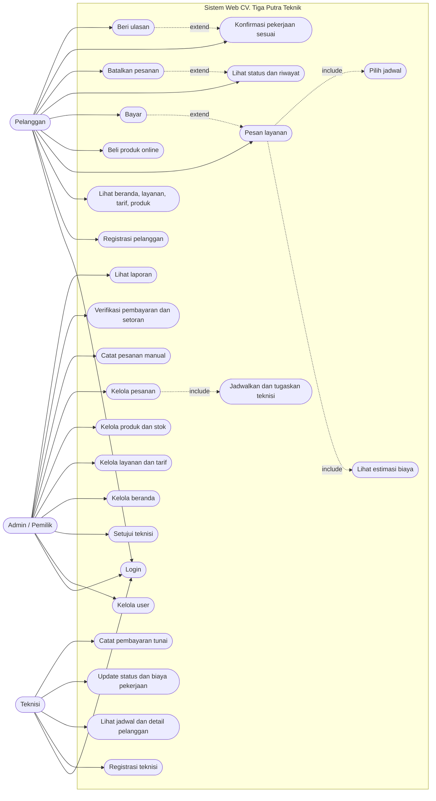

# PRD: Ekosistem Layanan dan Marketplace Pendingin Udara Berbasis Web, CV. Tiga Putra Teknik

Versi 0.5 | 2 Oktober 2026 | Status: siap dikembangkan. Verifikasi ke narasumber (Bab 3.8) masih tertunda

Sumber: Bab III (wawancara 29 dan 30 September 2026), use case diagram, skema database v0.4, jawaban pengembang atas pertanyaan terbuka dan follow-up teknisi. Poin yang masih terbuka ditandai **\[TBD\]**.

---

## 1. Ringkasan

Website untuk CV. Tiga Putra Teknik (Pangkep) yang menyatukan pemesanan jasa service AC, penjualan komponen pendingin, dan pengelolaan operasional (jadwal, stok, pembayaran, laporan). Peran pengguna: Pelanggan, Admin (pemilik), dan Teknisi.

Proyek ini dikerjakan sebagai tugas kuliah. Developer adalah satu orang, dan pemilik usaha adalah ayah developer.

### 1.1 Konteks akademik

Sistem ini bukan rilis produksi. Keluarannya dipakai untuk tiga mata kuliah dalam satu proyek Laravel (PHP):

| Mata kuliah | Keluaran | Bagian PRD yang paling relevan |
| --- | --- | --- |
| Desain Antarmuka | UI/UX: wireframe, mockup, prototipe, panduan gaya biru-abu | Pengguna (4), use case (7), kemudahan bagi pengguna 50+ (11) |
| Pemrograman Lanjut | Proyek Laravel: MVC, migration, autentikasi, hak akses, logika bisnis | Aturan bisnis (8), alur status (9), model data (10) |
| Pemrograman Web | Struktur HTML, CSS, JS | Halaman Blade responsif, validasi form, estimasi biaya dinamis, filter katalog |

Sistem dirancang seolah dipakai secara nyata: alur, validasi, keamanan, dan aturan bisnis dibuat lengkap. Yang dummy hanya data awal (`data_dummy.sql`), yang bisa diganti pemilik kapan saja. Tidak ada tenggat yang mengikat, jadi urutan pengerjaan mengikuti prioritas di bagian 5.1.

## 2. Latar belakang dan masalah

- Pesanan jasa dan pembelian komponen masuk lewat telepon atau WhatsApp ke pemilik.
- Jadwal kunjungan kadang tidak tercatat dan hanya diingat. Stok dan transaksi dicatat manual.
- Calon pelanggan sulit menghubungi teknisi dan tidak tahu estimasi harga sebelum memesan.
- Usaha belum punya sarana promosi online.
- Kondisi saat ini: **teknisinya hanya satu orang, yaitu pemilik sendiri.** Fitur teknisi mitra disiapkan untuk pengembangan usaha, tetapi sistem harus sudah berguna bagi pemilik yang bekerja sendirian.

## 3. Tujuan dan indikator

Pemilik tidak menetapkan target angka, dan keluaran proyek adalah tugas kuliah. Indikator berikut kualitatif dan bisa diuji saat demo dengan data dummy:

| Tujuan | Indikator keberhasilan |
| --- | --- |
| Semua pesanan tercatat | Pesanan dari online, telepon/WA, dan toko ada di satu daftar |
| Jadwal tidak lagi mengandalkan ingatan | Teknisi melihat jadwal hari ini, dan sistem menolak jadwal bentrok |
| Harga jelas di awal | Pelanggan melihat estimasi biaya sebelum konfirmasi |
| Stok akurat | Stok berkurang saat lunas dan kembali saat batal, tercatat di riwayat stok |
| Pemilik mandiri | Katalog dan harga diubah tanpa developer |
| Cepat | Halaman termuat kurang dari 3 detik |
| Memenuhi tiga mata kuliah | UI konsisten dan lengkap untuk tiga peran, kode Laravel terstruktur (MVC), HTML/CSS/JS rapi dan responsif |

## 4. Pengguna

| Peran | Profil | Kebutuhan utama |
| --- | --- | --- |
| Admin / pemilik | Abdul Haris Rahman, 59 tahun, pemilik sekaligus teknisi, pengalaman 20 tahun. Saat ini juga bekerja sebagai teknisi (lihat rekomendasi di bagian 7). | Menerima dan mencatat pesanan, mengatur jadwal dan stok, melihat transaksi, promosi |
| Pelanggan | Rumah tangga dan mahasiswa di Pangkep, contoh persona: Raihan Nur Faiz, 19 tahun, mahasiswa di Pangkep | Mudah memesan, harga jelas, melihat ulasan, memantau status |
| Teknisi | Bisa pemilik sendiri atau mitra. Mitra mendaftar sendiri dan disetujui admin. | Menerima tugas, melihat alamat, jenis AC, dan keluhan, menghitung biaya di lokasi, mencatat pembayaran |

Antarmuka admin harus sederhana karena penggunanya berusia 59 tahun: tombol besar, alur pendek, bahasa sehari-hari.

## 5. Ruang lingkup

**Masuk MVP**

- Registrasi dan login tiga peran, persetujuan akun teknisi oleh admin
- Beranda, daftar layanan dengan tarif per jenis AC, katalog produk dengan stok
- Pemesanan jasa dan pembelian produk online (jasa saja, produk saja, atau keduanya)
- Estimasi biaya sebelum konfirmasi
- Pencatatan pesanan manual oleh admin (dari toko, telepon, atau WhatsApp)
- Penjadwalan dan penugasan teknisi, pencegahan jadwal bentrok
- Update status pekerjaan dan penyesuaian biaya oleh teknisi
- Pembayaran tunai dan transfer manual dengan verifikasi admin, pencatatan setoran tunai
- Pengantaran produk lewat driver, ongkir dihitung dari jarak (jarak diinput admin) dan dibayar pelanggan
- Perhitungan bagi hasil teknisi mitra di laporan (pembayaran ke teknisi di luar sistem)
- Pembatalan dengan pengembalian stok
- Konfirmasi hasil pekerjaan, ulasan dan rating
- Kelola user, beranda, layanan, tarif, produk, stok, dan laporan transaksi

**Tahap lanjutan (disiapkan di skema, belum dibangun)**

- Pembayaran online lewat Midtrans (sandbox)
- Pembatalan otomatis untuk pesanan produk yang tidak dibayar
- Integrasi aplikasi driver dan hitung jarak otomatis lewat peta
- Notifikasi WhatsApp otomatis

**Di luar lingkup:** area layanan di luar Pangkep, aplikasi mobile native, pelacakan lokasi.

### 5.1 Prioritas pengerjaan

| Prioritas | Fitur |
| --- | --- |
| 1 (inti demo) | Registrasi dan login, katalog, pesan layanan dengan estimasi, jadwal dan penugasan, update status, konfirmasi dan ulasan |
| 2 | Pembayaran dan verifikasi, stok dan riwayat, catat pesanan manual, pembatalan, kelola katalog dan beranda |
| 3 | Pengantaran dan ongkir, bagi hasil dan setoran, laporan |

## 6. Teknologi dan desain

### 6.1 Lingkungan pengembangan (rekomendasi)

| Kebutuhan | Rekomendasi | Alasan |
| --- | --- | --- |
| Server lokal, PHP, MySQL | **Laragon** sebagai lingkungan utama | Satu aplikasi sudah memuat PHP, web server, MySQL, Composer, dan Node. Herd versi gratis tidak menyertakan MySQL (layanan database ada di Herd Pro), jadi perlu pasang MySQL terpisah |
| Klien database | **DBeaver** | Menjalankan query, melihat data, membuat diagram ER dari database, ekspor dan impor dump. Koneksi ke `127.0.0.1:3306` |
| Kode | VS Code atau PhpStorm, Git dan GitHub | Riwayat perubahan dan cadangan kode |
| Desain | Figma | Wireframe, mockup, prototipe, panduan gaya |

Catatan:

- Pakai satu lingkungan saja. Menjalankan Herd dan Laragon bersamaan bisa bentrok di port 80 dan 3306. Bila tetap ingin Herd, gunakan Herd Pro atau MySQL terpisah (mis. DBngin).
- Sumber kebenaran skema adalah **migration Laravel**, bukan file SQL. `skema_database_v0.4.sql` dan `data_dummy.sql` berfungsi sebagai rancangan yang akan diterjemahkan ke migration dan seeder. DBeaver dipakai untuk memeriksa hasilnya.
- Nama kolom `id_*` dipertahankan sesuai ERD, sehingga tiap model memakai `$primaryKey`.
- Konfigurasi lewat `.env` agar mudah dipasang di hosting nantinya. Domain dan hosting belum ada.

### 6.2 Stack aplikasi (rekomendasi)

| Lapisan | Pilihan |
| --- | --- |
| Framework | Laravel versi stabil terbaru, dengan versi PHP sesuai persyaratan Laravel tersebut, dan MySQL |
| Autentikasi | Laravel Breeze (Blade), ditambah kolom `role`, middleware peran, dan policy untuk akses pesanan |
| Tampilan | Blade + Tailwind CSS (lewat Vite) + Alpine.js untuk interaksi ringan |
| JavaScript | JS biasa untuk estimasi biaya dinamis, filter katalog, dan validasi form, agar terlihat sebagai bagian Pemrograman Web |
| Data | Eloquent, migration, seeder dan factory (Faker locale `id_ID`) untuk data dummy |
| Logika bisnis | Service class, mis. `PesananService` untuk total biaya, stok, ongkir, dan bagi hasil, di dalam DB transaction |
| Berkas | Disk `public` untuk gambar katalog dan foto keluhan, disk privat untuk bukti bayar |
| Notifikasi | Notifikasi database bawaan Laravel, ditambah tombol WhatsApp (`wa.me`) |
| Laporan | Query Eloquent + Chart.js |
| Kualitas kode | Laravel Pint (gaya kode), Pest atau PHPUnit untuk aturan kritis: stok, status, ongkir, bagi hasil, jadwal bentrok |
| Tahap lanjutan | Midtrans PHP SDK (sandbox), Leaflet + OpenStreetMap untuk jarak, Laravel scheduler untuk pembatalan otomatis |

Jika dosen Pemrograman Web mewajibkan CSS tulisan tangan, ganti Tailwind dengan CSS biasa yang memakai variabel (token di 6.4). Struktur halaman tidak berubah.

### 6.3 Sengaja tidak dipakai

Livewire, Inertia, React/Vue, Filament, Spatie Permission, Docker/Sail, Redis, API terpisah, dan microservice. Tambahan kompleksitasnya tidak sebanding untuk proyek satu developer. Filament khususnya mengambil alih tampilan admin, padahal UI/UX adalah salah satu keluaran yang dinilai. Spatie tidak perlu karena perannya hanya tiga dan tetap.

### 6.4 Prinsip desain dan tampilan

**Referensi:** shot Dribbble "Home Services Website UI Design, Shiny Surface" (tampilan beranda situs jasa kebersihan dan teknis). Dipakai sebagai inspirasi tata letak dan suasana, bukan untuk disalin. Logo, ikon, ilustrasi, dan foto dibuat sendiri atau memakai foto pekerjaan pemilik.

**Pola yang terlihat pada referensi, dan penerapannya di sistem ini**

| Pola pada referensi | Penerapan di sistem ini |
| --- | --- |
| Header: logo, kolom lokasi dengan tombol "Locate me", pilihan bahasa, Log In, menu | Logo dan nama usaha, kolom "Cek area layanan" (pilih kecamatan di Pangkep, divalidasi dengan JS), Login/Daftar, menu, ikon keranjang. Tanpa pilihan bahasa karena MVP hanya Bahasa Indonesia |
| Hero: panel putih besar bersudut membulat di atas latar abu muda, judul besar dengan kata kunci berwarna biru | Judul tentang manfaat, misalnya "Service AC Rapi, Datang ke Rumah Anda", dengan kata kunci berwarna biru |
| Empat kartu layanan kecil (ikon + label) di dalam hero | Cuci AC, Perbaikan, Pasang AC, Toko Komponen |
| Rating "5.0" dengan bintang | Rata-rata rating dari tabel `review`, hanya tampil bila sudah ada ulasan |
| Foto orang bekerja di kanan hero, sudut membulat | Foto pemilik atau teknisi saat bekerja (foto asli, lebih meyakinkan) |
| Tombol bulat biru besar "Make an appointment" menumpuk di sudut foto | Tombol bulat "Pesan layanan" di hero. Di ponsel dipindah menjadi tombol lebar penuh di bawah hero, agar tidak menutupi konten |
| Bagian "Our Services": label kecil biru, judul tebal dengan kata biru, grid kartu ikon garis dalam dua baris, satu kartu terpilih berlatar biru solid | Grid kartu: 6 layanan + Komponen AC + "Lihat semua". Latar biru solid dipakai sebagai keadaan terpilih atau hover |
| Carousel foto beserta label dan panah | Galeri pekerjaan atau produk unggulan |
| "Order Process" tiga langkah bernomor 01, 02, 03 | 01 Pilih layanan dan jenis AC, 02 Pilih jadwal dan lihat estimasi, 03 Bayar (tunai atau transfer) |
| Testimoni: kartu ulasan dengan bintang, tombol "View All", angka pelanggan puas | Ulasan dari tabel `review`, angka pelanggan puas dihitung dari pesanan berstatus `dikonfirmasi`, bukan angka tetap |
| Pita biru penuh lebar dengan tombol putih "Request an Estimate" | "Hitung estimasi biaya" yang membuka form estimasi |
| Footer navy gelap dengan kolom Company, Legal, For Customers, Connect With Us | Footer navy: Tentang kami, Kebijakan privasi, Pesan layanan dan cek status, Kontak dan WhatsApp, alamat toko |

Hal pada referensi yang sengaja diubah: teks keterangan di referensi sangat kecil dan abu-abu muda, sedangkan pengguna sistem ini mencakup usia 50 tahun ke atas. Teks isi tetap minimal 16 px, dan kontras teks dicek ulang. Referensi hanya mencakup halaman publik. Dashboard admin dan teknisi memakai warna dan komponen yang sama, tetapi lebih padat fungsi dan lebih besar area sentuhnya.

**Prinsip**

1. **Kepercayaan lebih dulu.** Rating dan ulasan, pengalaman usaha, area layanan, dan kontak WhatsApp terlihat sejak beranda, karena pelanggan ragu memilih teknisi (Bab III).
2. **Satu aksi utama per layar.** Tombol "Pesan layanan" konsisten bentuk dan posisinya. Tombol lain berperan sekunder.
3. **Bersih dan sejuk.** Ruang kosong lapang, kartu bersudut membulat, bayangan halus, permukaan terang. Kesan yang dituju: rapi, higienis, dingin.
4. **Harga dan status selalu jelas.** Estimasi biaya dan status pesanan tampil sebagai komponen yang sama di setiap halaman.
5. **Mobile-first.** Dirancang dari layar ponsel dulu, lalu diperluas ke desktop.
6. **Konsisten.** Satu kumpulan komponen (tombol, kartu, form, badge, tabel) dipakai di semua halaman dan semua peran.
7. **Ramah pengguna 50+ (admin).** Teks isi minimal 16 px, area sentuh minimal 44 px, label berupa teks (tidak hanya ikon), konfirmasi sebelum aksi yang tidak bisa dibatalkan, alur pendek.
8. **Tidak mengandalkan warna saja.** Status ditampilkan dengan teks dan warna. Kontras teks memenuhi WCAG AA (diperiksa dengan pemeriksa kontras).
9. **Umpan balik lengkap.** Setiap halaman punya kondisi loading, kosong, sukses, dan galat.
10. **Bahasa Indonesia sehari-hari**, singkat, tanpa istilah teknis.

**Token awal (usulan, dimatangkan di Figma)**

| Token | Nilai usulan | Dipakai untuk |
| --- | --- | --- |
| Biru utama | `#1E63D6` | Tombol utama, tautan, elemen aktif |
| Biru tua | `#14407F` | Header, judul |
| Biru muda | `#E8F1FD` | Latar bagian, badge lembut |
| Aksen sejuk | `#20B7C9` | Sorotan kecil, ikon layanan |
| Abu latar | `#F5F7FA` | Latar halaman dan area di belakang panel hero |
| Navy gelap | `#0F1F44` | Footer, teks judul di atas latar terang |
| Abu garis | `#E3E8EF` | Garis, batas kartu |
| Abu teks | `#5B6675` | Teks sekunder |
| Teks utama | `#1F2937` | Teks isi |
| Sukses / Peringatan / Bahaya | `#1E9E6A` / `#F2A93B` / `#D64545` | Status dan validasi |

Nilai warna diperkirakan dari gambar referensi, bukan dari file desainnya. Ambil nilai pasti dengan color picker di Figma, lalu perbarui tabel ini.

Warna badge status pesanan: menunggu (abu), dijadwalkan (biru), dikerjakan (kuning), dikirim (aksen sejuk), selesai dan dikonfirmasi (hijau), dibatalkan (merah).

**Tipografi dan bentuk:** referensi memakai huruf sans-serif geometris yang bersih. Padanannya Plus Jakarta Sans, Outfit, atau Inter (gratis di Google Fonts) untuk judul dan isi, dengan skala ukuran konsisten dan isi 16 px. Sudut membulat 12 sampai 16 px, jarak berpola kelipatan 8 px, ikon garis satu keluarga berwarna biru seperti pada referensi (Lucide atau Heroicons), foto asli pekerjaan dan teknisi lebih diutamakan daripada ilustrasi generik.

**Gerak:** transisi halus 150 sampai 250 ms untuk hover dan buka-tutup elemen, dan menghormati pengaturan "kurangi gerakan" pengguna.

### 6.5 Peta halaman

Ringkasan: **Pelanggan 21 halaman** (5 di navbar), **Admin 17 halaman** (11 menu sidebar), **Teknisi 7 halaman** (4 menu navigasi bawah). Total sekitar 45 halaman. Halaman login dipakai bersama oleh ketiga peran dan dihitung sekali (di pelanggan). Halaman galat (403, 404, 500) tidak dihitung.

#### 6.5.1 Pelanggan

Navbar: logo, **5 menu** (Beranda, Layanan, Toko, Ulasan, Tentang dan Kontak), ikon keranjang, serta tombol Masuk/Daftar. Setelah login, tombol itu menjadi menu akun (Pesanan saya, Profil, Keluar). Di ponsel, navbar menjadi hamburger.

| No | Halaman | Path | Isi dan fungsi | Akses |
| --- | --- | --- | --- | --- |
| 1 | **Beranda** (navbar) | `/` | Hero, kartu layanan, grid layanan, galeri, cara memesan, ulasan, ajakan estimasi | Publik |
| 2 | **Layanan** (navbar) | `/layanan` | Daftar layanan dengan harga mulai dari | Publik |
| 3 | **Toko** (navbar) | `/toko` | Katalog komponen, pencarian, urut harga, hanya yang tersedia | Publik |
| 4 | **Ulasan** (navbar) | `/ulasan` | Rata-rata rating dan daftar ulasan | Publik |
| 5 | **Tentang dan Kontak** (navbar) | `/kontak` | Profil usaha, area layanan Pangkep, WhatsApp, alamat toko | Publik |
| 6 | Detail layanan | `/layanan/{id}` | Deskripsi, tarif per jenis AC, tombol Pesan | Publik |
| 7 | Estimasi biaya | `/estimasi` | Pilih layanan, jenis AC, jumlah unit, lalu estimasi tampil dinamis. Jenis perlu survei diarahkan ke konsultasi | Publik |
| 8 | Pesan layanan | `/pesan` | Tiga langkah: layanan, jenis AC, unit; jadwal, alamat, merek, keluhan, foto; ringkasan dan konfirmasi | Login |
| 9 | Detail produk | `/toko/{id}` | Foto, harga, stok, tombol ke keranjang | Publik |
| 10 | Keranjang | `/keranjang` | Daftar produk dan jumlah | Publik |
| 11 | Checkout | `/checkout` | Pilih ambil di toko atau antar driver, alamat, ringkasan. Ongkir diisi admin dan diberitahukan sebelum bayar | Login |
| 12 | Pembayaran | `/pesanan/{id}/bayar` | Rincian biaya, rekening, unggah bukti transfer | Login |
| 13 | Pesanan berhasil | `/pesanan/{id}/berhasil` | Konfirmasi dan langkah berikutnya | Login |
| 14 | Pesanan saya | `/akun/pesanan` | Riwayat pesanan dan status | Login |
| 15 | Detail pesanan | `/akun/pesanan/{id}` | Garis waktu status, rincian biaya, jadwal dan teknisi, tombol Bayar, Batalkan, Konfirmasi, Beri ulasan | Login |
| 16 | Profil | `/akun/profil` | Data diri, alamat, ganti kata sandi | Login |
| 17 | Login (bersama) | `/masuk` | Satu form untuk semua peran, lalu diarahkan sesuai peran | Publik |
| 18 | Daftar | `/daftar` | Registrasi pelanggan | Publik |
| 19 | Lupa kata sandi (opsional) | `/lupa-sandi` | Perlu pengaturan email | Publik |
| 20 | Kebijakan privasi | `/kebijakan-privasi` | Perlindungan data (UU PDP), tautan di footer | Publik |
| 21 | Syarat dan ketentuan | `/syarat` | Aturan pemesanan dan pembatalan, tautan di footer | Publik |

#### 6.5.2 Admin

Layout dashboard dengan sidebar berisi **11 menu**. Awalan path `/admin`. Akun admin tidak punya registrasi publik. Jika admin mengaktifkan profil teknisi, sidebar menampilkan tautan "Tugas saya" ke halaman teknisi.

| No | Menu sidebar | Path | Isi dan fungsi |
| --- | --- | --- | --- |
| 1 | Dashboard | `/admin` | Ringkasan: pesanan menunggu, jadwal hari ini, pembayaran perlu verifikasi, stok menipis, teknisi menunggu persetujuan |
| 2 | Pesanan | `/admin/pesanan` | Semua pesanan dari online, toko, dan telepon/WA, dengan filter status, sumber, tanggal |
| 3 | Jadwal | `/admin/jadwal` | Kalender atau daftar jadwal per teknisi, peringatan bentrok |
| 4 | Pembayaran | `/admin/pembayaran` | Tab: perlu verifikasi, semua pembayaran, setoran tunai |
| 5 | Layanan dan Tarif | `/admin/layanan` | Tab: layanan, tarif per jenis AC (matriks), jenis AC |
| 6 | Produk dan Stok | `/admin/produk` | Tab: produk, riwayat stok |
| 7 | Pelanggan | `/admin/pelanggan` | Daftar pelanggan |
| 8 | Teknisi | `/admin/teknisi` | Daftar teknisi, persetujuan akun, aktif atau nonaktif |
| 9 | Laporan | `/admin/laporan` | Tab: transaksi, bagi hasil. Bisa diekspor |
| 10 | Konten beranda | `/admin/beranda` | Teks hero, foto, galeri, dan promosi |
| 11 | Pengaturan | `/admin/pengaturan` | Tab: usaha dan rekening, ongkir, pembatalan, akun saya (termasuk profil teknisi saya) |

Halaman pendukung (di luar sidebar):

| No | Halaman | Path | Isi dan fungsi |
| --- | --- | --- | --- |
| 12 | Detail pesanan | `/admin/pesanan/{id}` | Jadwalkan dan tugaskan, isi jarak, ongkir, dan driver, ubah biaya, verifikasi bayar, batalkan |
| 13 | Catat pesanan manual | `/admin/pesanan/buat` | Untuk pesanan dari toko atau telepon/WA, pelanggan tanpa akun cukup nama dan telepon |
| 14 | Form layanan | `/admin/layanan/buat` dan `/{id}/ubah` | Tambah dan ubah layanan |
| 15 | Form produk | `/admin/produk/buat` dan `/{id}/ubah` | Tambah dan ubah produk |
| 16 | Detail pelanggan | `/admin/pelanggan/{id}` | Data dan riwayat pesanan |
| 17 | Detail teknisi | `/admin/teknisi/{id}` | Profil, jadwal, status setoran, bagi hasil |

Aksi kecil memakai jendela modal, bukan halaman: restok atau koreksi stok, verifikasi bukti bayar, setujui atau tolak teknisi, konfirmasi hapus dan batal.

#### 6.5.3 Teknisi

Dirancang mobile-first karena dipakai di lapangan. Navigasi bawah berisi **4 menu**. Awalan path `/teknisi`.

| No | Halaman | Path | Isi dan fungsi |
| --- | --- | --- | --- |
| 1 | Jadwal hari ini (menu) | `/teknisi` | Tugas hari ini berurut jam |
| 2 | Semua tugas (menu) | `/teknisi/tugas` | Mendatang dan selesai, filter status |
| 3 | Pembayaran (menu) | `/teknisi/pembayaran` | Tunai yang dicatat, status setoran, bagian saya (untuk mitra) |
| 4 | Profil (menu) | `/teknisi/profil` | Data diri, ganti kata sandi |
| 5 | Detail tugas | `/teknisi/tugas/{id}` | Alamat, patokan, jenis dan merek AC, keluhan, foto, tombol telepon dan WhatsApp, update status, ubah biaya dengan catatan, catat tunai |
| 6 | Daftar teknisi | `/teknisi/daftar` | Registrasi mitra |
| 7 | Menunggu persetujuan | `/teknisi/menunggu` | Tampil setelah login selama akun belum disetujui admin |

Urutan beranda mengikuti referensi: header, hero (judul, empat kartu layanan, rating, foto, tombol "Pesan layanan"), grid layanan, galeri pekerjaan atau produk unggulan, cara memesan dalam 3 langkah, ulasan pelanggan, pita ajakan "Hitung estimasi biaya", footer.

## 7. Use case

**Rekomendasi peran pemilik dan teknisi.** Sistem tidak mengasumsikan bahwa pemilik juga teknisi. Admin dan teknisi adalah peran terpisah di `users`. Kondisi sekarang (pemilik bekerja sebagai teknisi) dibuat sebagai pengaturan opsional: admin bisa mengaktifkan "profil teknisi saya", yang membuat satu baris `teknisi` berjenis `pemilik` dengan `id_user` yang sama. Dampaknya:

- Penjadwalan hanya mengenal teknisi berstatus aktif, dari mana pun asalnya.
- Teknisi jenis `pemilik` tidak dikenai bagi hasil dan setoran.
- Bila pemilik berhenti turun ke lapangan, profil itu cukup dinonaktifkan tanpa mengubah kode.
- Data dummy memuat satu teknisi `pemilik` dan dua `mitra` agar semua alur bisa didemokan.

### 7.1 Pelanggan

| ID | Fitur | Kriteria penerimaan |
| --- | --- | --- |
| P-01 | Registrasi dan login | Nama, no. telepon, alamat, email, kata sandi |
| P-02 | Lihat layanan dan produk | Tarif tampil per jenis AC. Produk menampilkan stok, dan stok 0 tidak bisa dipesan |
| P-03 | Pesan layanan | Pilih layanan, jenis AC, jumlah unit, jadwal, alamat (hanya Pangkep), merek AC, keluhan dan kebutuhan, patokan lokasi, foto opsional |
| P-04 | Estimasi biaya | Tampil sebelum konfirmasi, diberi label "estimasi" karena bisa berubah setelah survei |
| P-05 | Beli produk | Pilih ambil di toko atau antar driver. Untuk antar, ongkir diisi admin dan harus dibayar pelanggan sebelum barang dikirim |
| P-06 | Bayar | Tunai (jasa, ambil di toko) atau transfer dengan unggah bukti. Midtrans pada tahap lanjutan |
| P-07 | Status dan riwayat | Status pesanan dan pembayaran terkini, rincian biaya |
| P-08 | Batalkan pesanan | Sesuai aturan di bagian 8.3 |
| P-09 | Konfirmasi dan ulasan | Konfirmasi pekerjaan sesuai, lalu rating 1 sampai 5 dan komentar |

### 7.2 Admin

| ID | Fitur | Kriteria penerimaan |
| --- | --- | --- |
| A-01 | Kelola user dan setujui teknisi | Akun teknisi baru berstatus menunggu persetujuan sampai admin menyetujui |
| A-02 | Kelola beranda | Teks, gambar, dan promosi diubah tanpa developer |
| A-03 | Kelola layanan, jenis AC, tarif | Tarif per kombinasi layanan dan jenis AC |
| A-04 | Kelola produk dan stok | Tambah, ubah, restok, koreksi stok, dengan riwayat |
| A-05 | Kelola pesanan | Satu daftar untuk semua sumber pesanan (online, toko, telepon/WA) |
| A-06 | Catat pesanan manual | Untuk pelanggan tanpa akun: nama dan telepon cukup |
| A-07 | Jadwalkan dan tugaskan | Pilih teknisi, tanggal, dan jam. Sistem menolak jadwal bentrok |
| A-08 | Jarak, ongkir, dan driver | Isi jarak dan info driver, ongkir dihitung otomatis dari jarak |
| A-09 | Verifikasi pembayaran dan setoran | Bukti transfer, status setoran tunai teknisi mitra |
| A-10 | Laporan | Ringkasan transaksi per periode dan bagi hasil teknisi mitra |

### 7.3 Teknisi

| ID | Fitur | Kriteria penerimaan |
| --- | --- | --- |
| T-01 | Registrasi dan login | Akun aktif setelah disetujui admin |
| T-02 | Jadwal dan detail pesanan | Jadwal hari ini di halaman utama. Terlihat alamat dan patokan lokasi, jenis dan merek AC, keluhan, kebutuhan, dan nomor telepon pelanggan |
| T-03 | Update status dan biaya | Ubah status ke dikerjakan dan selesai. Boleh menyesuaikan biaya tambahan di lokasi dengan catatan alasan, lalu menyampaikan ke pelanggan |
| T-04 | Catat pembayaran tunai | Tunai yang diterima dicatat. Untuk mitra, status setoran awal "belum disetor" |

Fitur teknisi mitra masih berbasis asumsi, karena saat ini belum ada mitra.

## 8. Aturan bisnis

### 8.1 Harga dan biaya

- Total = (tarif layanan x jumlah unit) + biaya tambahan + subtotal produk + ongkir.
- Tarif dan harga disalin ke pesanan saat dipesan, sehingga perubahan katalog tidak mengubah pesanan lama.
- Tarif bervariasi menurut jenis AC. Biaya tambahan boleh diubah teknisi atau admin, wajib disertai catatan alasan.
- Jenis AC yang dilayani (hasil riset): split dinding (0,5 sampai 1 PK dan 1,5 sampai 2 PK), cassette, standing floor, ceiling suspended, portable, jendela, serta central, multi split, VRF, dan ducted.
- Jenis central/multi split/VRF/ducted ditandai **perlu survei**: tarif tidak otomatis, hanya layanan konsultasi dan survei yang bisa dipesan, lalu biaya diisi setelah survei.
- Merek AC dicatat sebagai keterangan dan tidak memengaruhi tarif.

### 8.2 Stok

- Stok berkurang saat pembayaran berstatus lunas dan tercatat di `riwayat_stok`.
- Stok kembali bila pesanan dibatalkan setelah stok dikurangi.
- Penjualan langsung di toko tercatat lunas saat itu juga.

### 8.3 Pembatalan (rekomendasi, perlu persetujuan)

| Status pesanan | Pelanggan | Admin |
| --- | --- | --- |
| menunggu | Boleh kapan saja | Boleh |
| dijadwalkan (jasa) | Boleh sampai 12 jam sebelum jam kerja. Lewat itu, hubungi admin | Boleh, jadwal dilepas |
| dikerjakan | Tidak | Boleh dengan alasan |
| dikirim (produk) | Tidak | Boleh dengan alasan |
| selesai, dikonfirmasi | Tidak | Tidak. Keluhan ditangani di luar sistem |

Ketentuan: alasan pembatalan wajib diisi. Pembatalan mencatat siapa dan kapan. Jika pembayaran sudah lunas, admin mengembalikan dana secara manual lalu mengubah status pembayaran menjadi `dikembalikan`.

Alasan memilih 12 jam: pemilik bekerja sendiri, jadi pembatalan mendadak langsung merugikan jadwal. Angkanya bisa diganti sesuai kebiasaan usaha.

### 8.4 Pengantaran produk

- Hanya untuk pesanan produk di Pangkep. Produk yang dipesan bersama jasa dibawa teknisi saat kunjungan, tanpa ongkir.
- Driver dipesan admin secara manual di luar sistem. Admin mengisi jarak dari toko dan info driver, ongkir dihitung otomatis.
- Pesanan antar dikirim setelah pembayaran lunas.
- Rumus ongkir (parameter dummy di tabel `pengaturan`): Rp10.000 untuk 3 km pertama, ditambah Rp2.500 per km berikutnya, dibulatkan ke Rp500, maksimal 30 km. Contoh: 8 km = 10.000 + (5 x 2.500) = Rp22.500.

### 8.5 Pembayaran dan setoran

- Jasa dibayar setelah pekerjaan selesai, tunai atau lewat sistem.
- Tunai yang diterima teknisi mitra harus disetor ke pemilik. Sistem mencatat status setoran. Perhitungan bagi hasil dijelaskan di bagian 8.6.
- Jika pemilik sendiri yang menerima tunai, setoran tidak diperlukan.

### 8.6 Bagi hasil teknisi mitra (rekomendasi)

Karena bagi hasil berbeda tiap pekerjaan, rekomendasinya persentase per layanan:

- Tiap layanan punya persentase default untuk teknisi (`layanan.persen_teknisi`). Nilai dummy: cuci AC 50%, perbaikan 40%, pasang baru 40%, bongkar pasang 40%, isi freon 40%, konsultasi 50%.
- Saat pesanan dijadwalkan, persentase disalin ke pesanan (`pesanan.persen_teknisi`) agar perubahan di kemudian hari tidak mengubah pesanan lama. Admin boleh mengubahnya per pesanan untuk pekerjaan yang lebih berat atau lebih ringan.
- Dasar hitung hanya jasa: (tarif layanan x unit) + biaya tambahan. Harga produk dan ongkir tidak dibagi, karena itu margin toko dan biaya driver.
- Contoh: cuci AC split 1 PK, 2 unit, Rp75.000 per unit, tanpa biaya tambahan, bagian teknisi 50%. Dasar Rp150.000, bagian teknisi Rp75.000, bagian pemilik Rp75.000.
- Teknisi jenis `pemilik` tidak dikenai bagi hasil.
- Laporan menampilkan bagian teknisi per pesanan dan per periode. Pembayaran ke teknisi dilakukan di luar sistem.

## 9. Alur status pesanan

- Jasa: `menunggu` → `dijadwalkan` → `dikerjakan` → `selesai` → `dikonfirmasi`
- Produk ambil di toko: `menunggu` → `selesai`
- Produk antar: `menunggu` → `dikirim` → `selesai`
- Semua status sebelum `selesai` dapat menjadi `dibatalkan` sesuai bagian 8.3.

Status pembayaran: `belum_bayar`, `menunggu_verifikasi`, `lunas`, `ditolak`, `dikembalikan`.

## 10. Model data

15 tabel (file terpisah: `skema_database_v0.4.sql`, data dummy di `data_dummy.sql`): `users`, `admin`, `pelanggan`, `teknisi`, `layanan`, `jenis_ac`, `tarif_layanan`, `produk`, `riwayat_stok`, `pesanan`, `detail_pesanan`, `schedule`, `pembayaran`, `review`, `pengaturan`.

Perbaikan dari v0.1: arah foreign key, kardinalitas, tipe data, kolom NOT NULL yang tidak realistis, tarif per jenis AC, pesanan tanpa akun dan tanpa layanan, sumber pesanan, ongkir dan driver, pencatatan pembatalan, status setoran, batasan unik jadwal teknisi, jenis AC dengan penanda perlu survei, persentase bagi hasil, jarak dan ongkir, jenis teknisi (pemilik atau mitra), dan tabel pengaturan.

## 11. Kebutuhan non-fungsional

- Usability: dapat dipakai tanpa panduan, termasuk oleh pengguna 50 tahun ke atas.
- Performa: halaman termuat kurang dari 3 detik.
- Keandalan: tidak ada pesanan atau stok yang hilang atau selisih. Pengurangan stok memakai transaksi database.
- Keamanan: kata sandi di-hash, akses dibatasi per peran (middleware dan policy), data pelanggan dilindungi sesuai UU PDP.
- Validasi input di sisi server untuk semua form, proteksi CSRF (bawaan Laravel), pembatasan percobaan login.
- Unggahan dibatasi tipe dan ukuran. Bukti pembayaran disimpan di penyimpanan privat.
- Cadangan basis data berkala (ekspor dump lewat DBeaver).
- Kompatibilitas: responsif di mobile dan desktop.
- Pemeliharaan: katalog dan harga bisa diubah mandiri oleh pemilik. Pemeliharaan sistem oleh developer.

## 12. Risiko

| Risiko | Mitigasi |
| --- | --- |
| Kebutuhan belum diverifikasi ke narasumber | Demo ke pemilik dan pelanggan sebelum finalisasi |
| Fitur teknisi mitra belum punya pengguna nyata | Utamakan alur pemilik sebagai teknisi, mitra sebagai tahap lanjutan |
| Pemilik kurang terbiasa dengan dashboard | Alur admin dibuat pendek, uji langsung dengan pemilik |
| Pelanggan terbiasa lewat WhatsApp | Sediakan tombol WhatsApp dan fitur catat pesanan manual |
| Harga AC bervariasi dan bisa berubah setelah survei | Label "estimasi", biaya tambahan dengan catatan alasan |
| Cakupan fitur cukup besar | Kerjakan sesuai prioritas di bagian 5.1, tahap lanjutan dipisah |

## 13. Keputusan dan hal yang perlu diganti

Tidak ada pertanyaan terbuka yang menghambat pengerjaan. Keputusan yang sudah diambil:

- Tidak ada tenggat yang mengikat.
- Sistem dirancang seolah dipakai nyata, dengan data dummy sebagai isi awal.
- Batas pembatalan jasa 12 jam sebelum jam kerja disetujui, dan dapat diubah di `pengaturan.batas_batal_jam`.

Referensi desain sudah diterima dan diterapkan di bagian 6.4.

Sebelum sistem dipakai pemilik secara nyata, data dummy berikut perlu diganti lewat panel admin atau tabel `pengaturan`: daftar layanan dan tarif, daftar komponen dan stok, rekening atau QRIS, nomor WhatsApp, persentase bagi hasil, dan parameter ongkir.

## 14. Catatan untuk revisi Bab III

- Persona Raihan Nur Faiz diubah ke Pangkep. Bab III masih menulis Makassar.
- Tambahkan kebutuhan baru: catat pesanan manual, tarif per jenis AC, pengantaran driver dengan ongkir, pembatalan, setoran tunai.
- UR-08 (teknisi mitra) sebaiknya diberi catatan bahwa saat ini teknisi hanya satu orang, yaitu pemilik, dan hasil follow-up sudah ada.
- Perbarui Bab 3.8 dan 3.9 dengan hasil follow-up ini.
- Sebutkan di ruang lingkup laporan bahwa keluaran adalah UI/UX, proyek Laravel, dan HTML/CSS/JS dengan data dummy.
